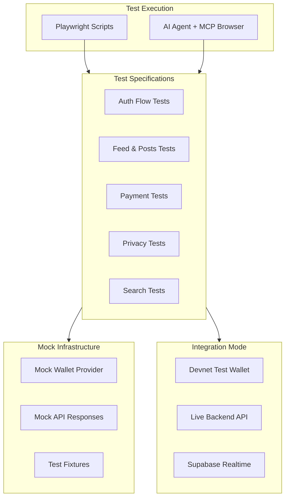

# E2E UI Test Suite for SolShare

## Architecture Overview



## Directory Structure

```
frontend/
├── e2e/
│   ├── playwright.config.ts      # Playwright configuration
│   ├── setup/
│   │   ├── global-setup.ts       # Test environment setup
│   │   ├── mock-wallet.ts        # Mock Dynamic.xyz wallet
│   │   └── test-fixtures.ts      # Reusable test data
│   ├── specs/
│   │   ├── auth.spec.ts          # Authentication tests
│   │   ├── feed.spec.ts          # Feed and posts tests
│   │   ├── profile.spec.ts       # Profile tests
│   │   ├── payments.spec.ts      # Tip, subscribe tests
│   │   ├── privacy.spec.ts       # Shield, private tip tests
│   │   ├── search.spec.ts        # Semantic search tests
│   │   └── token-gate.spec.ts    # Token-gated content tests
│   ├── pages/                    # Page Object Models
│   │   ├── base.page.ts
│   │   ├── feed.page.ts
│   │   ├── profile.page.ts
│   │   └── modals/
│   │       ├── tip.modal.ts
│   │       ├── shield.modal.ts
│   │       └── create-post.modal.ts
│   └── ai-agent/
│       ├── test-runner.md        # AI agent test execution guide
│       └── test-cases/           # Human-readable test cases for AI
│           ├── auth-tests.md
│           ├── privacy-tests.md
│           └── ...
```

## Test Coverage Matrix

| Feature | Component | Mock Mode | Integration Mode |

|---------|-----------|-----------|------------------|

| **Auth** | WalletButton | Connect mock wallet | Connect Phantom devnet |

| **Feed** | PostFeed, PostCard | Mock API responses | Live feed from backend |

| **Create Post** | CreatePostModal | Mock upload + moderation | Real IPFS upload |

| **Like/Comment** | LikeButton, CommentSection | Optimistic updates | Real Solana tx |

| **Tip** | TipModal | Mock tx confirmation | Real devnet tx |

| **Shield SOL** | ShieldModal | Mock balance update | Real Privacy Cash |

| **Private Tip** | TipModal (private) | Mock privacy flow | Real anonymous tip |

| **Search** | SearchBar | Mock search results | Real semantic search |

| **Token Gate** | TokenGateBadge | Mock access check | Real token verification |

## Key Implementation Details

### 1. Mock Wallet Provider

Create `frontend/e2e/setup/mock-wallet.ts` that intercepts Dynamic.xyz:

```typescript
// Inject mock wallet before page load
await page.addInitScript(() => {
  window.__MOCK_WALLET__ = {
    address: 'TestWa11etAddressForE2ETesting111111111',
    signMessage: async (msg) => 'mock-signature-base58',
    signTransaction: async (tx) => tx, // Return unsigned for mock
  };
});
```

### 2. Test Fixtures

Leverage existing [`lib/mock-data.ts`](frontend/lib/mock-data.ts) and extend with:

- Test users (creator, tipper, follower)
- Test posts with various states
- Pre-configured privacy balances

### 3. Page Object Model

Example for TipModal (`frontend/e2e/pages/modals/tip.modal.ts`):

```typescript
export class TipModal {
  constructor(private page: Page) {}
  
  async open(creatorWallet: string) {
    await this.page.click(`[data-testid="tip-button-${creatorWallet}"]`);
  }
  
  async setAmount(sol: number) {
    await this.page.fill('[data-testid="tip-amount"]', sol.toString());
  }
  
  async togglePrivate(enabled: boolean) {
    const toggle = this.page.locator('[data-testid="private-tip-toggle"]');
    if ((await toggle.isChecked()) !== enabled) {
      await toggle.click();
    }
  }
  
  async submit() {
    await this.page.click('[data-testid="send-tip-button"]');
  }
}
```

### 4. AI Agent Test Specification Format

Create human-readable test cases in `frontend/e2e/ai-agent/test-cases/`:

```markdown
## Test: Private Tip Flow

### Preconditions
- User authenticated with test wallet
- User has shielded balance >= 0.1 SOL
- Creator profile exists

### Steps
1. Navigate to creator profile: /profile/{CREATOR_WALLET}
2. Click "Tip" button on any post
3. Enter amount: 0.05 SOL
4. Toggle "Tip Privately" switch ON
5. Verify shielded balance shown
6. Click "Send Tip"
7. Wait for transaction confirmation

### Expected Results
- Toast shows "Private tip sent!"
- Shielded balance decreased by 0.05 SOL
- Creator's tip history shows new tip (no sender shown)
```

## npm Scripts

Add to [`frontend/package.json`](frontend/package.json):

```json
"scripts": {
  "test:e2e": "playwright test",
  "test:e2e:mock": "MOCK_MODE=true playwright test",
  "test:e2e:integration": "MOCK_MODE=false playwright test",
  "test:e2e:ui": "playwright test --ui",
  "test:e2e:debug": "playwright test --debug"
}
```

## Environment Configuration

Create `frontend/e2e/.env.test`:

```bash
# Mock mode (fast, no real transactions)
MOCK_MODE=true

# Test wallet for integration mode
TEST_WALLET_PRIVATE_KEY=base58-encoded-devnet-key
TEST_WALLET_ADDRESS=YourTestWalletAddress

# Backend URLs
TEST_API_URL=http://localhost:3001/api
TEST_FRONTEND_URL=http://localhost:3000
```

## CI/CD Integration

Add GitHub Actions workflow `.github/workflows/e2e-tests.yml`:

```yaml
- name: Run E2E Tests (Mock Mode)
  run: npm run test:e2e:mock
  
- name: Run E2E Tests (Integration)
  if: github.ref == 'refs/heads/main'
  run: npm run test:e2e:integration
  env:
    TEST_WALLET_PRIVATE_KEY: ${{ secrets.TEST_WALLET_KEY }}
```