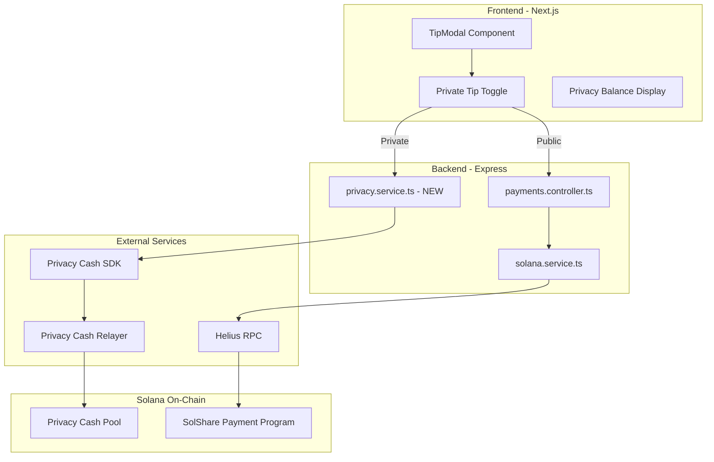
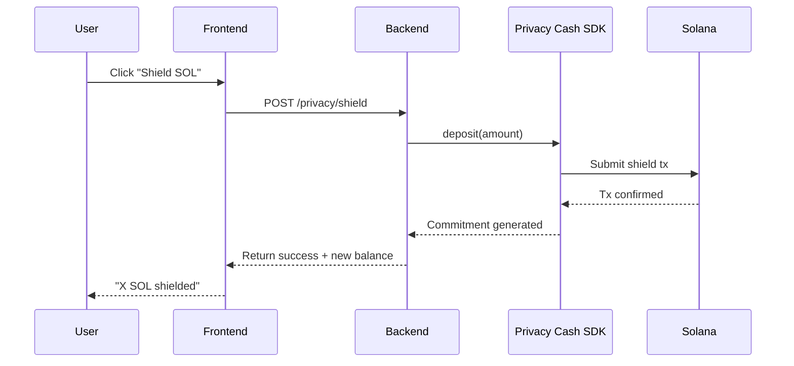
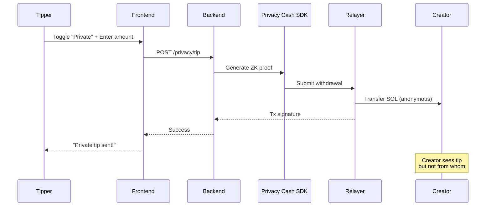

# SolShare Privacy Hackathon Integration Plan

## Hackathon Details

- **Event:** Solana Privacy Hack (January 12-30, 2026)
- **Submissions Due:** February 1, 2026
- **Track:** Open Track ($18,000 pool)
- **Target Bounties:**
  - Privacy Cash "Best Integration to Existing App": $6,000
  - Helius "Best Privacy Project": $5,000
  - Range "Compliant Privacy" (bonus): $1,500

---

## Integration Architecture



---

## Phase 1: Backend Privacy Service (Days 1-2)

### 1.1 Install Privacy Cash SDK

In [backend/package.json](backend/package.json), add:

```json
"dependencies": {
  "privacy-cash-sdk": "^1.1.0"
}
```

The SDK provides these main APIs:

- `deposit(amount)` - Shield SOL into privacy pool
- `withdraw(amount, recipient)` - Withdraw to any address privately
- `getPrivateBalance()` - Get shielded balance

### 1.2 Create Privacy Service

Create new file `backend/src/services/privacy.service.ts`:

```typescript
// Key methods to implement:
class PrivacyService {
  // Initialize Privacy Cash client with user's keypair
  async initClient(userKeypair: Keypair): Promise<PrivacyCash>
  
  // Shield SOL into privacy pool (user deposits funds)
  async shieldSol(amount: number): Promise<TransactionSignature>
  
  // Private withdrawal to creator (anonymous tip)
  async privateTip(
    creatorWallet: string, 
    amount: number
  ): Promise<TransactionSignature>
  
  // Get user's shielded balance
  async getShieldedBalance(): Promise<number>
}
```

### 1.3 Add Privacy Routes

Update [backend/src/routes/payments.routes.ts](backend/src/routes/payments.routes.ts):

```typescript
// New endpoints for private payments
router.post('/privacy/shield', authMiddleware, privacyController.shield);
router.post('/privacy/tip', authMiddleware, privacyController.privateTip);
router.get('/privacy/balance', authMiddleware, privacyController.getBalance);
```

### 1.4 Update Payments Controller

Add to [backend/src/controllers/payments.controller.ts](backend/src/controllers/payments.controller.ts):

```typescript
// Shield SOL into privacy pool
async shield(req, res) {
  const { amount } = req.body;
  // Build transaction for user to shield funds
}

// Send private tip
async privateTip(req, res) {
  const { creatorWallet, amount } = req.body;
  // Execute private withdrawal to creator
}
```

---

## Phase 2: Frontend Privacy UI (Days 3-4)

### 2.1 Add Privacy Cash Types

Create `frontend/src/types/privacy.ts`:

```typescript
interface PrivacyBalance {
  shielded: number;      // Lamports in privacy pool
  available: number;     // Ready for private tips
  pending: number;       // Pending confirmations
}

interface PrivateTipRequest {
  creatorWallet: string;
  amount: number;        // In lamports
  isPrivate: true;
}
```

### 2.2 Update TipModal Component

Modify the TipModal to add privacy toggle:

```typescript
// In TipModal.tsx
const [isPrivate, setIsPrivate] = useState(false);
const [shieldedBalance, setShieldedBalance] = useState(0);

// Show privacy option
<Switch 
  checked={isPrivate} 
  onCheckedChange={setIsPrivate}
  label="Tip Privately"
/>

// If private, check shielded balance first
// If insufficient, prompt to shield funds first
```

### 2.3 Create Privacy Balance Component

New component `frontend/src/components/PrivacyBalance.tsx`:

- Shows shielded balance
- "Shield SOL" button to add funds to privacy pool
- Status indicator (shielded funds available)

### 2.4 Update API Client

Add to `frontend/src/lib/api.ts`:

```typescript
const privacyApi = {
  getBalance: () => api.get('/payments/privacy/balance'),
  shield: (amount: number) => api.post('/payments/privacy/shield', { amount }),
  privateTip: (data: PrivateTipRequest) => api.post('/payments/privacy/tip', data),
};
```

---

## Phase 3: Privacy Flow Implementation (Days 5-6)

### 3.1 Shield Flow (User deposits to privacy pool)



### 3.2 Private Tip Flow



### 3.3 Privacy Service Implementation Details

```typescript
// backend/src/services/privacy.service.ts
import { PrivacyCash, ZkKeypair } from 'privacy-cash-sdk';

export class PrivacyService {
  private client: PrivacyCash | null = null;
  
  async initClient(userSecret: string) {
    const zkKeypair = ZkKeypair.fromSecretKey(userSecret);
    this.client = new PrivacyCash(
      env.SOLANA_RPC_URL,
      zkKeypair
    );
    return this.client;
  }
  
  async privateTip(creatorWallet: string, amount: number) {
    if (!this.client) throw new Error('Client not initialized');
    
    // Generate ZK proof and withdraw to creator
    const result = await this.client.withdraw(amount, creatorWallet);
    
    // Log tip (without revealing tipper) for creator dashboard
    await this.logPrivateTip(creatorWallet, amount, result.signature);
    
    return result;
  }
}
```

---

## Phase 4: Database Updates (Day 5)

### 4.1 New Tables for Privacy Features

Add migration for tracking private payments (without revealing tipper):

```sql
-- Private tips log (creator can see they got tipped, but not by whom)
CREATE TABLE private_tips (
    id UUID PRIMARY KEY DEFAULT gen_random_uuid(),
    creator_wallet VARCHAR(44) NOT NULL,
    amount BIGINT NOT NULL,           -- In lamports
    tx_signature VARCHAR(88) NOT NULL,
    post_id VARCHAR(44),              -- Optional: tip on specific post
    timestamp TIMESTAMP WITH TIME ZONE DEFAULT NOW()
);

-- User privacy settings
CREATE TABLE user_privacy_settings (
    wallet VARCHAR(44) PRIMARY KEY,
    default_private_tips BOOLEAN DEFAULT FALSE,
    created_at TIMESTAMP WITH TIME ZONE DEFAULT NOW()
);
```

---

## Phase 5: Testing & Documentation (Days 7-8)

### 5.1 Test Cases

1. **Shield Flow Test**

   - User shields 0.1 SOL
   - Verify balance updates
   - Verify commitment stored

2. **Private Tip Test**

   - User sends private tip to creator
   - Creator receives SOL
   - Tipper identity not revealed on-chain
   - Tip shows in creator dashboard (amount only)

3. **Integration Test**

   - Full flow: Connect wallet -> Shield -> Private tip -> Verify

### 5.2 Demo Video Requirements (max 3 minutes)

1. **Intro (30s):** What is SolShare + privacy problem we solve
2. **Demo Shield (45s):** Show shielding SOL into privacy pool
3. **Demo Private Tip (60s):** Send anonymous tip, show creator receives it
4. **Technical (30s):** Show Privacy Cash SDK integration
5. **Compliance (15s):** Mention Helius RPC + existing AI moderation

### 5.3 Documentation Updates

Update [README.md](README.md) with:

- Privacy features overview
- How private tipping works
- Architecture diagram
- Hackathon credits (Privacy Cash, Helius, Range)

---

## Key Files to Create/Modify

### New Files

- `backend/src/services/privacy.service.ts` - Privacy Cash SDK integration
- `backend/src/controllers/privacy.controller.ts` - Privacy endpoints
- `backend/src/routes/privacy.routes.ts` - Privacy routes
- `backend/migrations/006_privacy_tables.sql` - Privacy database schema
- `frontend/src/components/privacy/PrivacyBalance.tsx` - Shielded balance display
- `frontend/src/components/privacy/ShieldModal.tsx` - Shield SOL modal
- `frontend/src/hooks/usePrivacy.ts` - Privacy state hook
- `frontend/src/types/privacy.ts` - Privacy TypeScript types

### Modified Files

- [backend/src/routes/payments.routes.ts](backend/src/routes/payments.routes.ts) - Add privacy routes
- [backend/src/controllers/payments.controller.ts](backend/src/controllers/payments.controller.ts) - Add private tip handling
- [backend/package.json](backend/package.json) - Add privacy-cash-sdk dependency
- `frontend/src/components/TipModal.tsx` - Add privacy toggle
- [docs/FRONTEND_TECHNICAL_SPEC.md](docs/FRONTEND_TECHNICAL_SPEC.md) - Update with privacy features

---

## Environment Variables (New)

Add to backend `.env`:

```bash
# Privacy Cash Configuration
PRIVACY_CASH_RELAYER_URL=https://relayer.privacy.cash
PRIVACY_CASH_PROGRAM_ID=9fhQBbumKEFuXtMBDw8AaQyAjCorLGJQiS3skWZdQyQD
```

---

## Bounty Submission Checklist

### Privacy Cash ($6k "Best Integration to Existing App")

- [ ] Integrate Privacy Cash SDK for private tips
- [ ] Working shield and withdraw flow
- [ ] Demo video showing integration
- [ ] Document SDK usage

### Helius ($5k "Best Privacy Project")

- [ ] Already using Helius RPC in backend
- [ ] Mention in submission that Helius powers all RPC calls
- [ ] Show Helius usage in architecture docs

### Open Track ($18k pool)

- [ ] Deploy to Solana devnet
- [ ] All code open source
- [ ] 3-minute demo video
- [ ] Documentation on how to run

---

## Timeline Summary

| Day | Tasks |

|-----|-------|

| 1-2 | Backend: Privacy service, routes, controller |

| 3-4 | Frontend: TipModal update, PrivacyBalance component |

| 5 | Database migrations, integration testing |

| 6 | Full flow testing, bug fixes |

| 7 | Demo video recording |

| 8 | Documentation, submission prep |